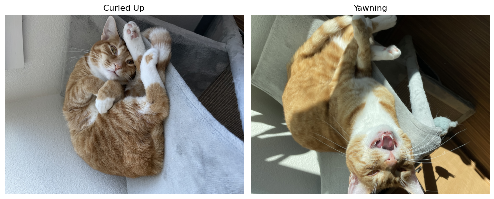
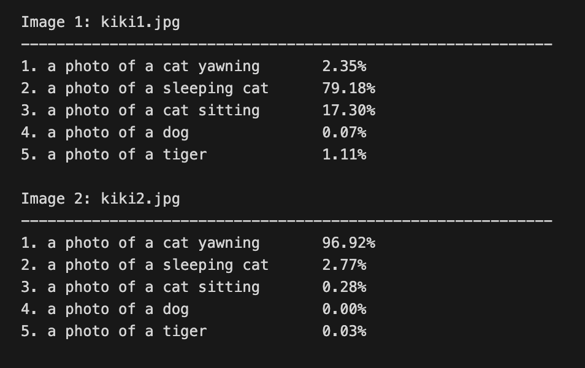

# Learning Transferable Visual Models from Natural Language Supervision (CLIP)

**Authors:** Alec Radford, Jong Wook Kim, Chris Hallacy, Aditya Ramesh, Gabriel Goh, Sandhini Agarwal, Girish Sastry, Amanda Askell, Pamela Mishkin, Jack Clark, Gretchen Krueger, Ilya Sutskever — *OpenAI (2021)*  
**ArXiv:** [https://arxiv.org/abs/2103.00020](https://arxiv.org/abs/2103.00020)

---

## 1. Overview and Motivation

### What is CLIP?

**CLIP (Contrastive Language–Image Pre-training)** is a **multimodal model** created by **OpenAI in 2021** that learns to connect **images and natural language**.  
It was trained on **400 million image–text pairs** collected from the internet — a dataset known as **WebImageText (WIT)**.

In simpler terms, CLIP learns to understand what an image represents by matching it with its written description.  
For example, if it sees a picture of a dog and the caption *“a photo of a dog,”* it learns that those two belong together in the same conceptual space.  
Over time, CLIP can recognize new images not by memorizing class labels, but by comparing them to text prompts — deciding whether a new image is closer to *“a cat”* or *“a dog.”*

Unlike older vision models trained on fixed labels like ImageNet’s 1,000 categories, CLIP learns directly from **natural language supervision**.  
It trains two encoders:
- a **Vision Encoder** (ResNet or Vision Transformer) to process images, and  
- a **Text Encoder** (Transformer) to process text.  

Each encoder outputs an embedding — a numerical representation — and CLIP’s training objective is to **align** matching image and text embeddings while separating mismatched ones.  
This creates a **shared semantic space** where meaning can be measured by proximity.

As a result, CLIP can perform **zero-shot classification** — classifying new images using only text descriptions, without any labeled data.

<p align="center">
  
</p>

---

### How CLIP Works: Training vs. Inference

CLIP has two encoders — one for **images** and one for **text** — that both output embeddings in the same shared space.  
During **training**, it learns from paired image–text examples.  
During **inference**, it can be used flexibly with just an image, just text, or both.

#### Training Phase
- Input: Paired images and captions from the WebImageText dataset.  
- Objective: Bring matching pairs closer and push mismatched ones apart.  
- Result: A unified embedding space where vision and language align.

<p align="center">
  
</p>

#### Inference Phase
Once trained, CLIP can perform a range of tasks using this shared space.

| Task | Input | What CLIP Does |
|------|--------|----------------|
| **Zero-shot Classification** | Image + list of text prompts | Finds which caption best matches the image. |
| **Text-to-Image Search** | Text query + gallery of images | Finds images that best match the description. |
| **Image Similarity** | Two or more images | Finds which images are visually or semantically similar. |

<p align="center">
  
</p>

**In simpler terms:**  
During training, CLIP learns *how* images and text relate.  
During inference, it applies that knowledge — allowing you to give it an image or a piece of text and still make meaningful comparisons.

---

### Real-World Example: Why CLIP is Useful

CLIP’s ability to connect vision and language has made it the foundation of many modern AI systems.

- **Image Generation:** Models like **OpenAI’s DALL·E** use CLIP’s representations to interpret text prompts (for example, *“a cat wearing sunglasses on the beach”*) and generate matching images.  
- **Search and Retrieval:** CLIP powers **image search engines**, allowing users to find relevant images from natural-language queries like *“people holding umbrellas at night”* — no predefined labels needed.  
- **Content Moderation:** CLIP can flag harmful or policy-violating imagery by comparing image embeddings to descriptive text prompts such as *“graphic violence”* or *“explicit content.”* Because it understands context, it can distinguish between *a medical illustration* and *harmful imagery*, which traditional classifiers often fail to do.  
- **Accessibility:** CLIP’s vision–language alignment helps systems generate meaningful descriptions for visually impaired users, enabling better alt-text and scene understanding.

In short, CLIP bridges the gap between **language and perception**, powering applications that both **create** and **understand** visual content.

---

### Why CLIP Matters

Before CLIP, vision models relied on human-labeled datasets like ImageNet — accurate but narrow and costly to maintain.  
CLIP showed that models could instead learn from **natural language at internet scale**, capturing richer visual and contextual understanding.

This shift represented a turning point in AI.  
By replacing human-curated labels with **natural language supervision**, CLIP enabled true **zero-shot generalization** — recognizing new concepts simply through text.  
It became the blueprint for multimodal foundation models like **DALL·E**, **Flamingo**, and **GPT-4V (GPT-4 with Vision)**.

<p align="center">
  
</p>

---

## 2. Architecture Overview

CLIP consists of two main components trained jointly:
1. **Image Encoder** — extracts a visual embedding from an input image.  
   - Backbone: ResNet-50 or Vision Transformer (ViT-B/32).  
2. **Text Encoder** — extracts a semantic embedding from a text prompt.  
   - Backbone: 12-layer Transformer (same architecture as GPT-2 small).

Both encoders map their inputs into a **shared embedding space**, where similarity between an image and a caption is measured by the **cosine similarity** of their embeddings.  
During training, CLIP uses a **contrastive loss** that maximizes agreement between corresponding image–text pairs and minimizes it for mismatched ones.

<p align="center">
  
</p>

---

### Pseudocode: CLIP’s Core Training Objective

```python
# Given a batch of N (image, text) pairs
I_f = image_encoder(images)      # Extract visual features [N, D]
T_f = text_encoder(texts)        # Extract text features [N, D]

# Normalize embeddings
I_e = normalize(I_f)
T_e = normalize(T_f)

# Compute similarity matrix
logits = (I_e @ T_e.T) * exp(t)  # Temperature-scaled cosine similarities
labels = arange(N)

# Symmetric contrastive loss
loss_i = CrossEntropyLoss(logits, labels)
loss_t = CrossEntropyLoss(logits.T, labels)
loss = (loss_i + loss_t) / 2
```

**Key Differences from Prior Work:**
- Uses **contrastive objectives** instead of classification or caption prediction.
- Constructs a **joint embedding space** across vision and language.
- Leverages **prompt engineering** (e.g., “a photo of a {label}”) to improve zero-shot generalization.

---

## Code Demonstration

See `clip_demo.ipynb` for a full demonstration using a pre-trained CLIP model.

### What the Demo Shows

#### Loading Pre-trained CLIP Model
- Loads OpenAI’s CLIP ViT-B/32 model.  
- Architecture: Vision Transformer (image encoder) + Transformer (text encoder).  
- Joint embedding dimension: 512.  
- Enables zero-shot evaluation on any image–text pair.

#### Image–Text Similarity Computation
- Two input images (`kiki` and `kiki2`) show the same cat (“Kiki”) in different states — curled up and yawning.  
- The model encodes each image and a set of descriptive text prompts.  
- Both image and text embeddings are projected into a shared latent space, and cosine similarity is computed.

<p align="center">
  
</p>

#### Zero-Shot Classification Example
- Each image is evaluated against natural-language prompts such as:
["a photo of a cat yawning",
"a photo of a sleeping cat",
"a photo of a cat sitting",
"a photo of a dog",
"a photo of a tiger"]

- CLIP outputs probability distributions for how well each text description matches the image.  
- This demonstrates CLIP’s ability to recognize both **objects** and **actions** (yawning vs. sleeping) without any fine-tuning.

<p align="center">

</p>

#### Key Takeaways
- CLIP aligns visual and linguistic representations through contrastive learning.  
- It generalizes beyond fixed labels, interpreting images using flexible natural-language descriptions.  
- The demo illustrates how CLIP captures semantic nuance — understanding that both photos depict a *cat*, yet identifying distinct behaviors purely from text context.

---

## 5. Critical Analysis

CLIP was a landmark paper, but several aspects deserve a closer look.

**Strengths:**  
CLIP showed impressive **zero-shot generalization** across 30+ benchmarks such as ImageNet, CIFAR-100, and Caltech101 — without any fine-tuning.  
Its contrastive learning objective and massive scale (400M image–text pairs) proved that **language can serve as a universal supervision signal**, enabling open-ended understanding rather than fixed label prediction.

**Weaknesses and Overlooked Areas:**  
The authors largely **underexplored the risks of uncurated web data**.  
Follow-up work found CLIP reflects **social and cultural bias**, sometimes linking gender or ethnicity to professions or misclassifying culturally sensitive images.  
The paper also gave little attention to **interpretability** — we still don’t fully know *what* CLIP attends to when associating text and images.

**Limitations:**  
CLIP struggles in **specialized domains** (e.g., medical or satellite imagery) and lacks domain-specific reasoning.  
Its closed-source dataset (WebImageText) also prevented reproducibility, later addressed by **OpenCLIP (LAION-5B)** which showed that **data quality matters more than quantity**.

**Disputes and Follow-Ups:**  
Other teams expanded or challenged CLIP’s findings:  
- **ALIGN (Google):** achieved better performance using cleaner data.  
- **LiT (Google Brain):** improved robustness by freezing the image encoder.  
- **OpenCLIP:** replicated CLIP and confirmed both its strengths and its biases.

**Assessment:**  
CLIP’s contribution is undeniable — it unified vision and language learning — but its blind spots around **bias, transparency, and interpretability** show that innovation outpaced reflection.  
Future multimodal models now build on CLIP’s insight while addressing these open challenges.


---

## 6. Impact

CLIP fundamentally changed how AI systems learn from and interpret the world.  
Before CLIP, vision models like ResNet or EfficientNet required large labeled datasets such as ImageNet.  
After CLIP, **natural language became the new supervision signal** — showing that images and text could be aligned without manual labeling.

This shift laid the groundwork for today’s **foundation models**, where a single multimodal architecture can perform many tasks: classification, retrieval, captioning, and reasoning — all in one shared embedding space.  
CLIP proved that large-scale, language-guided pretraining could replace years of task-specific engineering.

Its influence is visible across the AI landscape:
- **DALL·E and Stable Diffusion** use CLIP embeddings to connect text prompts to generated images.  
- **GPT-4V** extends this vision–language fusion to multimodal reasoning.  
- **Search and recommendation systems** at Google, Pinterest, and Adobe now rely on CLIP-like embeddings to match images and text naturally.

Beyond technical progress, CLIP also reshaped **AI ethics and reproducibility** discussions.  
Its use of uncurated web data sparked debates over bias, consent, and transparency, leading to new standards like **Model Cards** and **Data Documentation** practices.

In short, CLIP transformed AI from recognizing *what is in an image* to understanding *what that image means*.  
It bridged the gap between vision and language — a shift that continues to define the future of multimodal intelligence.

---

## 6. Questions for Discussion

**Q1 – Conceptual:**  
Is CLIP an *unsupervised* model, or does its use of natural language captions still count as *supervision*?  
→ *Discuss where “natural language supervision” fits on the spectrum between supervised and unsupervised learning.*

<details>
<summary><strong>💡 Reveal Answer</strong></summary>

CLIP is **not truly unsupervised** — it uses **text as a form of supervision**, because every image is paired with a caption during training.  
However, it’s also **not traditionally supervised**, since those captions are *free-form natural language*, not fixed category labels.  

This middle ground is often called **natural language supervision**.  
It allows CLIP to learn about visual concepts and relationships without ever being explicitly told “this is class #27 — cat.”  
By leveraging the structure of human language, CLIP generalizes far beyond the training categories — enabling **zero-shot recognition** and **open-vocabulary understanding**.

</details>

---

**Q2 – Mechanistic Understanding:**  
Why does CLIP’s *contrastive training objective* enable better generalization than traditional classification training?  
→ *What is the key advantage of learning relationships between image–text pairs instead of predicting a single label per image?*

<details>
<summary><strong>💡 Reveal Answer</strong></summary>

Traditional classifiers learn to map each image to one fixed label (like “cat” or “dog”), which limits them to the categories they were trained on.  
CLIP, instead, learns **relationships** — it aligns images and text together in a shared semantic space, learning what *goes with what*.  
This allows it to capture not just categories, but **context, attributes, and actions** — for example, distinguishing between *a sleeping cat* and *a yawning cat* even without explicit labels.

This is the same principle that makes **DALL·E** possible.  
When you ask DALL·E to generate *“a dinosaur wearing sunglasses riding a skateboard,”* it uses CLIP-like representations to understand how *those concepts relate to each other* — not as fixed categories, but as composable ideas in a shared vision–language space.  
That relational understanding is exactly what CLIP learns through its **contrastive training objective**, and it’s the reason it generalizes so well to new, open-ended prompts.
</details>


---

## 7. Resource Links

| Resource | Link |
|:--|:--|
| Paper (ArXiv) | [https://arxiv.org/abs/2103.00020](https://arxiv.org/abs/2103.00020) |
| OpenAI CLIP GitHub | [https://github.com/openai/CLIP](https://github.com/openai/CLIP) |
| OpenCLIP (LAION) | [https://github.com/mlfoundations/open_clip](https://github.com/mlfoundations/open_clip) |
| CLIP Blog | [https://openai.com/research/clip](https://openai.com/research/clip) |
| LAION Dataset Card | [https://laion.ai/blog/laion-5b/](https://laion.ai/blog/laion-5b/) |

---

## 8. Citation

Radford, A., Kim, J. W., Hallacy, C., Ramesh, A., Goh, G., Agarwal, S., Sastry, G., Askell, A., Mishkin, P., Clark, J., Krueger, G., & Sutskever, I. (2021). *Learning Transferable Visual Models from Natural Language Supervision.* arXiv preprint arXiv:2103.00020. [https://arxiv.org/abs/2103.00020](https://arxiv.org/abs/2103.00020)

Jia, C., Yang, Y., Xia, Y., Chen, Y.-T., Parekh, Z., Pham, H., Le, Q. V., Sung, Y.-H., Li, Z., & Duerig, T. (2021). *Scaling Up Visual and Vision-Language Representation Learning With Noisy Text Supervision (ALIGN).* In *Proceedings of ICML 2021.* https://arxiv.org/abs/2102.05918

Zhai, X., Wang, X., Mustafa, B., Steiner, A., Keysers, D., Kolesnikov, A., & Beyer, L. (2022). *LiT: Zero-Shot Transfer with Locked-Image Text Tuning.* In *Proceedings of CVPR 2022.* https://arxiv.org/abs/2111.07991

Ilharco, G., Wortsman, M., Wightman, R., Gordon, C., Carlini, N., Taori, R., Dave, A., Shankar, V., Namkoong, H., Miller, J., Hajishirzi, H., Schmidt, L., & Farhadi, A. (2021). *OpenCLIP: Reproducing CLIP Training with Open Data.* https://github.com/mlfoundations/open_clip

Ramesh, A., Dhariwal, P., Nichol, A., Chu, C., & Chen, M. (2021). *Zero-Shot Text-to-Image Generation (DALL·E).* arXiv preprint arXiv:2102.12092. https://arxiv.org/abs/2102.12092

